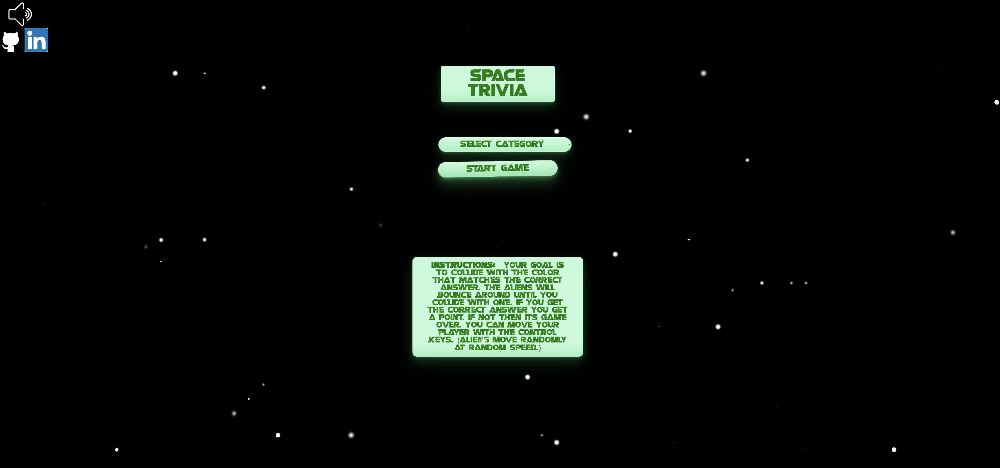
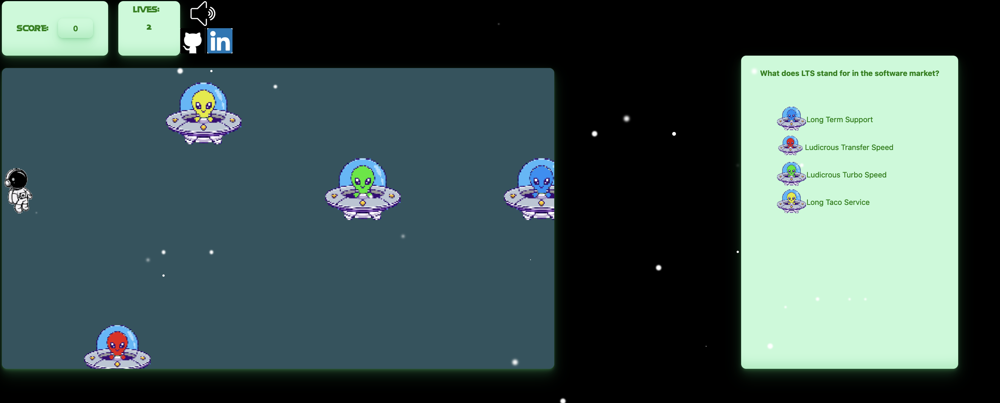

# Background


This game will be similar to a trivia game with some gaming skills needed. 
The goal of the user is to answer the question by trying to collide with 
the correct sprite that matches the answer.
1) If the user collides with a sprite with the wrong solution to the trivia
question, then you lose a life.
2) After you lose all three lives, then its game over.
3) if the player gets the answer correct then their score increases depending
    on the level.


## Functionality & MVP
With this game user's will be able to:
- Start, next round, and game over buttons
- Move your character up, down, left, and right using arrow keys.
- collide with sprites that are color coded to match possible solutions.
- trivia questions to pop up every level with 4 new possible answers after completing level
- scores adding up if answered correctly
- life deducted if answered incorrectly

<p align="center">

</p>

<p align="center">

</p>

<!-- In addition, this project will include:
- ReadMe
- An about Modal -->


## Technologies, Libraries, APIs
- The canvas api
- webpack to bundle and transpile the source Javascript code
- npm to manage project dependencies
- fetch api

## Code Snippets


### User Movements

```javascript
     window.addEventListener("keydown", (e)=> {
        e.preventDefault()
        switch(e.key){
            case "ArrowRight":
                if (player.position.x < 1030){
                    player.velocity.x = 5
                }else{
                    player.velocity.x = 0
                }
                
            break

            case "ArrowLeft":
                if (player.position.x > 0){
                    player.velocity.x = -5
                }else{
                    player.velocity.x = 0
                }
                
            break

            case "ArrowUp":
                if(player.position.y  > 10){
                    player.velocity.y = -5
                } else{
                    player.velocity.y = 0
                }
                break

            case "ArrowDown":
                if(player.position.y < 500){
                    player.velocity.y = 5
                } else{
                    player.velocity.y = 0
                }
                break
        }
    })

    window.addEventListener("keyup", (e) => {
        switch (e.key) {
            case "ArrowRight":
                player.velocity.x = 0
             
            break

            case "ArrowLeft":
                player.velocity.x = 0
               
            break

            case "ArrowUp":
                player.velocity.y = 0
               
                break

            case "ArrowDown":
                player.velocity.y = 0
               
                break
        }    
    })

```


### Collision Detection

```javascript
     function collision(colorPosition, colorCharacter, color) {
            let scores = document.getElementById("score")
            let life = document.getElementById("life")
            let ans = document.getElementById("answer")
            let questionBox = document.getElementById("question-box")
            let ansText = ans.innerText
            // console.log(ansText)
            
            if (player.position.x + player.character.width -20>= colorPosition.x
                && player.position.x +20 <= colorPosition.x + colorCharacter.width
                && player.position.y + player.character.height >= colorPosition.y +25
                && player.position.y <= colorPosition.y + colorCharacter.height - 20 && color !==ansText && lives === 0) {
                let gameBox = document.getElementById("game-box")
                let finalScore = document.getElementById("final-score")
                let scoreBoard = document.getElementById("scoreboard")
                let lives = document.getElementById("lives")

                finalScore.innerHTML = score
                scores.innerHTML = score
  
                gameOver.style.display = "block"
                gameBox.style.display = "none"
                questionBox.style.display = "none"
                scoreBoard.style.display = "none"
                lives.style.display = "none"

                player.position.x = -30
                player.position.y = 200

```

### Fetch Api 

```javascript
  trivia(url) {

        async function fetchNew() {
            try {
                const res = await fetch(url);

                if (res.ok) {
                    let data = await res.json();
                    return data;
                } else {
                    let data = await res.json();
                    throw data.meta.msg;
                }
            } catch (error) {
                console.warn(error)
            }

        }
  }

```


## Implementaition Timeline

- Friday:
 Setup project, including getting webpack up and running. Get canvas to show up 
on the screen, and spend time getting comfortable with the Canvas API. Create 
Board. Get Sprites and characters that I would be using for my trivia game. Also,
find an API for my trivia game. Research on what I need to do to create my game and 
what kind of libraries to include.

- Weekends:
Create the user character and it's controls. Get every Sprite to move and also getting
the trivia questions and answers to link with the different sprites which will adjust 
the score. Focus on creating the logic of my game. Make sure that it asks questions randomly.
Make sure the score increases after getting the correct answer.

- Monday:
Style a little more and make it look pretty for the user. Add some cool features to
make the game look like its moving. Include features such as a start game button.
A game over pop up when you lose. An instruction page, etc.

- Tuesday
Focus on adding more css to the page. Styling the text for the trivia. Making sure
the questions are big and visible. Make sure the core function of the game is working.


- Wednesday
work on  styling.


**Copyright Saleh Alkaheli**
